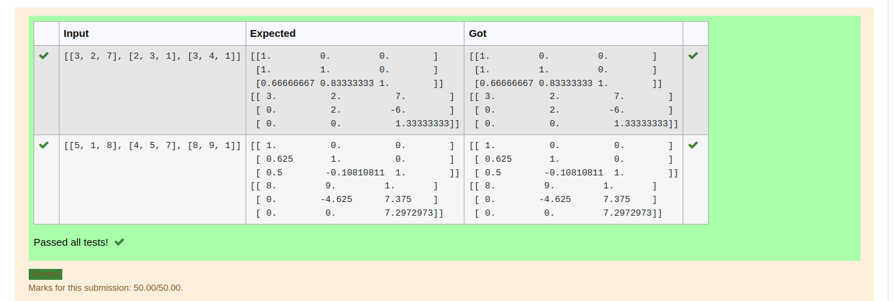
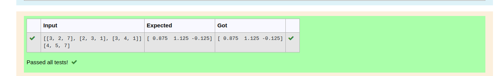

# LU Decomposition 

## AIM:
To write a program to find the LU Decomposition of a matrix.

## Equipments Required:
1. Hardware – PCs
2. Anaconda – Python 3.7 Installation / Moodle-Code Runner

## Algorithm
1. Write the code to find the LU Decompisition.
2. Recieve the input.
3. Execute the code.
4. Recieve the output.

## Program:
(i) To find the L and U matrix
```python
'''Program to find L and U matrix using LU decomposition.
Developed by: Vishnupriya R
RegisterNumber: 22006962
'''
import numpy as np
from scipy.linalg import lu
A=np.array(eval(input()))
P,L,U=lu(A)
print(L)
print(U)
```
(ii) To find the LU Decomposition of a matrix
```python
'''Program to solve a matrix using LU decomposition.
Developed by: Vishnupriya R
RegisterNumber: 22006962
'''

# To print X matrix (solution to the equations)
import numpy as np
from scipy.linalg import lu_factor,lu_solve
A=np.array(eval(input()))
b=np.array(eval(input()))
lu,piv=lu_factor(A)
x=lu_solve((lu,piv),b)
print(x)
```

## Output:
Finding LU Matrix


Finding LU Decomposition



## Result:
Thus the program to find the LU Decomposition of a matrix is written and verified using python programming.

